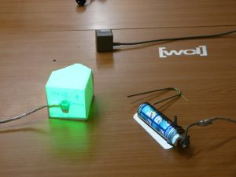
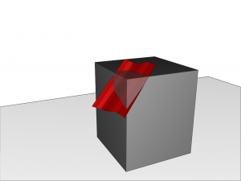
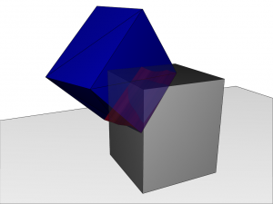
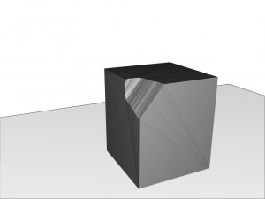
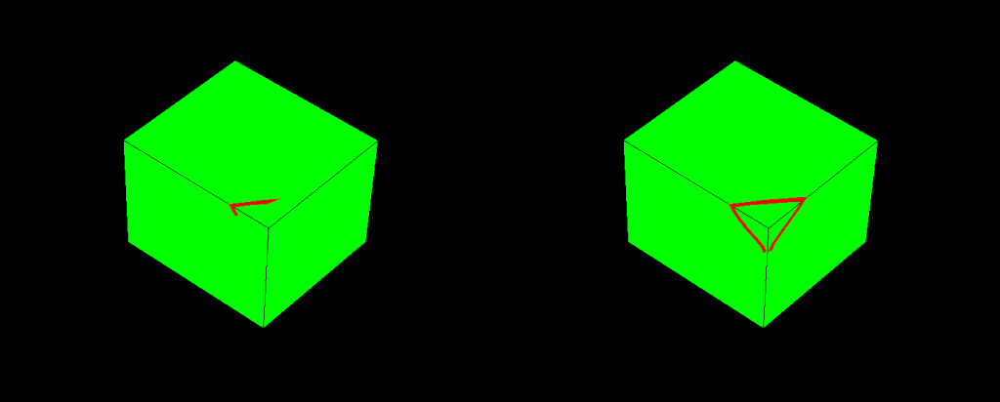
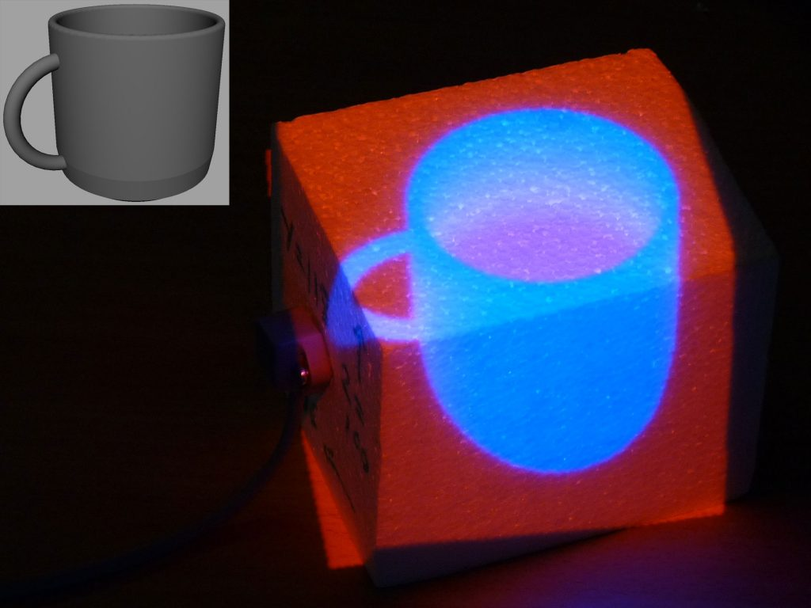
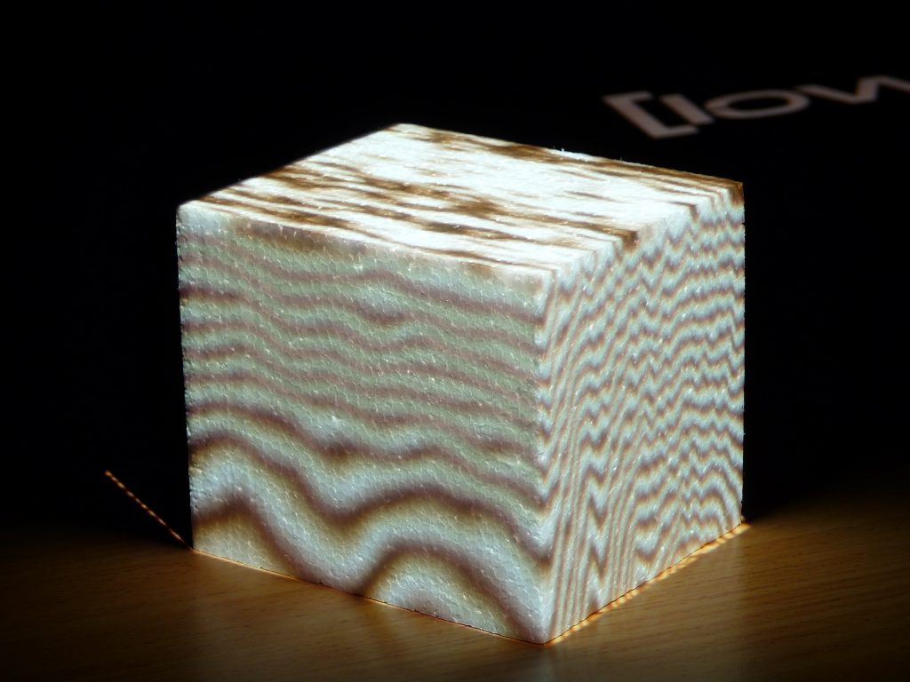

This weekend I presented my [paper][1], Augmented Foam Sculpting for Capturing 3D Models, at the International symposium on 3D user interfaces. Since the conference has passed, I have added the video to youtube and the paper to my publications page. First, the video, then some discussion after the jump.

  

## Foam Sculpting

The inspiration for this work came out of a project we did with some industrial design students. Their job was to create some input devices for my SAR Airbrushing system. First up, we had a  meeting where I showed them a very early stages of development version of the system, to give them an idea of what we were doing. They went away and came up with ideas for input devices, and in the next meeting had a bunch of sketches ready. We discussed the sketches; what we liked and what we didn&#8217;t like. Next, they brought us foam mockups of some of the designs. We discussed these, and then eventually they came back with full CAD models ready for 3D printing.

  This slideshow requires JavaScript.

They did a great job by the way. But it got us thinking:

_**How can we make this process better?**_

Augmented Foam Sculpting is the result of this work. It allows a designer/artist to simultaneously create a physical design mockup and matching virtual model. This is a Good Thing™, because it utilises the skills and tools that designers are already using.<figure id="attachment_836" aria-describedby="caption-attachment-836" style="width: 300px" class="wp-caption aligncenter">

 <figcaption id="caption-attachment-836" class="wp-caption-text">Tracked foam and foam cutter</figcaption></figure>

The system works by tracking the position and orientation of both the hot wire foam cutter, and the piece of foam the user is sculpting. We can track the motion of the hot wire as it passes through the foam.<figure id="attachment_830" aria-describedby="caption-attachment-830" style="width: 300px" class="wp-caption aligncenter">

 <figcaption id="caption-attachment-830" class="wp-caption-text">The path taken by the tracked wire cutter</figcaption></figure>

From there, we can create geometry that matches the cut path, and perform a Boolean difference operation on the foam geometry.<figure id="attachment_831" aria-describedby="caption-attachment-831" style="width: 300px" class="wp-caption aligncenter">

 <figcaption id="caption-attachment-831" class="wp-caption-text">The geometry used for the difference operation</figcaption></figure>

This replicates the cut in the physical object in the 3D model .<figure id="attachment_832" aria-describedby="caption-attachment-832" style="width: 300px" class="wp-caption aligncenter">

 <figcaption id="caption-attachment-832" class="wp-caption-text">The resulting object</figcaption></figure>

Using projectors, we can add extra information to the foam as the user sculpts. We implemented 2 visualisations to aid designers when creating specific models.

**Cut Animation** displays cuts to be made as animated lines on the foam surface. Once a cut has been made, the system moves to the next one. This visualisation could be used to recreate a previous object, or to instruct novices. An algorithm could be developed to calculate the actual cuts that need to be made, reducing the amount of planning needed when making an object.<figure id="attachment_837" aria-describedby="caption-attachment-837" style="width: 660px" class="wp-caption aligncenter">

 <figcaption id="caption-attachment-837" class="wp-caption-text">Animating target cuts for a designer to replicate</figcaption></figure>

The second visualisation, **Target**, projects a target model so that it appears to be inside the foam. The foam is coloured based on how much needs to be removed to match a target model. This could be used to create variations on a previous model.<figure id="attachment_838" aria-describedby="caption-attachment-838" style="width: 660px" class="wp-caption aligncenter">

 <figcaption id="caption-attachment-838" class="wp-caption-text">Projecting a target cut onto fresh foam. The colour coding indicates depth of cut</figcaption></figure>

Finally, we can use 3D procedural textures to change the appearance of the foam. For example, we implemented a wood grain 3D texture. This works pretty well, because as you cut away the foam, the texture updates to appear as though the wood was actually cut. 3D textures are also ideal because we don&#8217;t need to generate texture coordinates after each cut.<figure id="attachment_839" aria-describedby="caption-attachment-839" style="width: 660px" class="wp-caption aligncenter">

 <figcaption id="caption-attachment-839" class="wp-caption-text">Projecting a 3D procedural wood texture onto foam</figcaption></figure>

For all the details, please have a read of the paper. If you have any questions/comments/feedback/abuse, please comment on this post, or send me an email.

[1]: ../wp-content/uploads/2009/09/foamcutter.pdf
