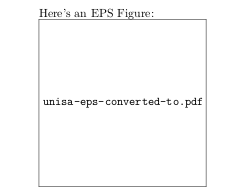
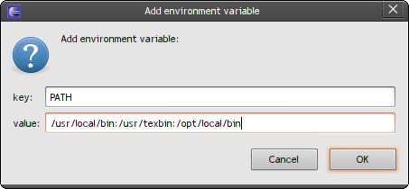

[][1] I&#8217;m currently in the early stages of writing my PhD thesis. I&#8217;m writing it using LaTeX, and I&#8217;m trying to get the _perfect_ build system and editing environment going. Yesterday I had a look at Texlipse, a plugin for Eclipse. There was one problem: EPS figures didn&#8217;t work.

In newish versions of Latex, if you use the epstopdf package, your images are converted on the fly, but this wasn&#8217;t  working in Texlipse. Luckily the fix is easy, and the rest of this post explains what to do.

<!--more-->

Lets start with a minimum working example to demonstrate the problem:

<pre lang="latex">\documentclass{minimal}
\usepackage{epsfig}
\usepackage{epstopdf}
\usepackage{graphicx}

\begin{document}

Here's an EPS Figure:

\includegraphics[height=5cm]{unisa}

\end{document}</pre>

Download [unisa.eps][2], and try this yourself. On Ubuntu, I get output that looks like this:<figure id="attachment_391" aria-describedby="caption-attachment-391" style="width: 244px" class="wp-caption aligncenter">

[][3]<figcaption id="caption-attachment-391" class="wp-caption-text">Broken PDFLatex output on Ubuntu</figcaption></figure>

  

    If you look at the console output generated by TexLipse, you will see one of two problems, described below.
  

  
  <h3>
    Problem 1: Shell escape feature is not enabled
  </h3>
  
  

    I encountered this problem on Ubuntu. If you see the following output:
  

  
  <pre lang="bash">pdflatex&gt; Package epstopdf Warning: Shell escape feature is not enabled.</pre>
  
  

    Then you have encountered this. The fix is quite easy.
  

  
  <ol>
    <li>
      Open up Eclipse Preferences
    </li>
    <li>
      Click on Texlipse Builder Settings
    </li>
    <li>
      Click on PdfLatex program, and press the edit button
    </li>
    <li>
      Add &#8211;shell-escape to the argument list as the first argument.
    </li>
    <li>
      You&#8217;re done! Rebuild your project and it should work fine.
    </li>
  </ol>
  
  <h3>
    Problem 2: Cannot Open Ghostscript
  </h3>
  
  

    I encountered this problem on OSX. Weird how the two systems have the same symptoms with different causes, but whatever. If you see the output:
  

  
  <pre lang="bash">pdflatex&gt; !!! Error: Cannot open Ghostscript for piped input</pre>
  
  

    Then you are suffering from problem 2. This problem is caused by the PATH environment variable not being set correctly when Texclipse runs pdflatex. Essentially, the Ghostcript program, gs, cannot be found by pdflatex. The fix is to add an environment variable to Texlipse&#8217;s builder settings so the path is corrected.
  

  
  <h4>
    Step 1: Locate Ghostscript, Repstopdf, and Perl
  </h4>
  
  

    Open up a terminal, and type:
  

  
  <pre lang="bash">which gs</pre>
  
  

    This should show you the directory where Ghostscript lives on your system. On my laptop it is:
  

  
  <pre lang="bash">/usr/local/bin</pre>
  
  

    Repeat the process with repstopdf:
  

  
  <pre lang="bash">which repstopdf</pre>
  
  

    Which on my system gives:
  

  
  <pre lang="bash">/usr/texbin</pre>
  
  

    And with perl:
  

  
  <pre lang="bash">which perl</pre>
  
  

    gives me:
  

  
  <pre lang="bash">/opt/local/bin</pre>
  
  

    The exact paths will depend on how you have installed these things. For example, Perl lives in /opt on my system because I installed it using macports. It doesn&#8217;t really matter. However, if you don&#8217;t have any of these packages installed, you will need to do so.
  

  
  <h4>
    Step 2: Create the Environment Variable
  </h4>
  
  

    Now that we know where the programs are installed, we need to create a PATH environment variable for Texlipse to use.
  

  
  <ol>
    <li>
      Open up Eclipse Preferences
    </li>
    <li>
      Go down to Environment, which is under Texlipse Builder Settings
    </li>
    <li>
      Click new to create a new environment variable
    </li>
    <li>
      the key should be set to PATH. The value should be the three directories, separated by colons (:). For example, on my system:  
    </li>
    <li>
      You&#8217;re done! Save the settings and everything should work.
    </li>
  </ol>
  
  <h3>
    Conclusions
  </h3>
  
  

    If you complete the steps above, depending on what problem you had (you may have even had both), then you should see the correct output, which looks like this:
  
<figure id="attachment_403" aria-describedby="caption-attachment-403" style="width: 244px" class="wp-caption aligncenter">
  
  <figcaption id="caption-attachment-403" class="wp-caption-text">EPS Figure working!</figcaption></figure> 
  
  

    Well, I hope that helps someone. Its surprising that this error came up on both of my computers. Searching the internet finds others with the same problem, but as yet no solutions. This post should fix that.
  

[1]: ../wp-content/uploads/2011/06/800px-LaTeX_logo.svg_-e1308095178677.png
[2]: 20papercups.net/wp-content/uploads/2011/06/unisa.eps "Unisa EPS Logo"
[3]: ../wp-content/uploads/2011/06/eps-broken.png
