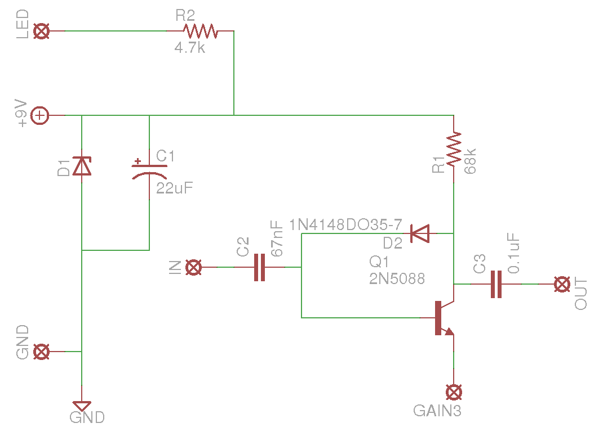
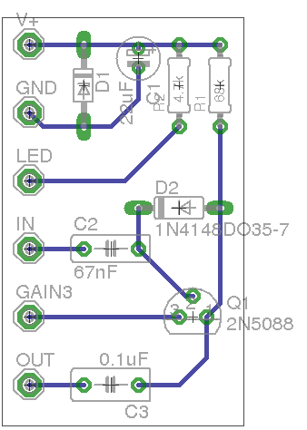
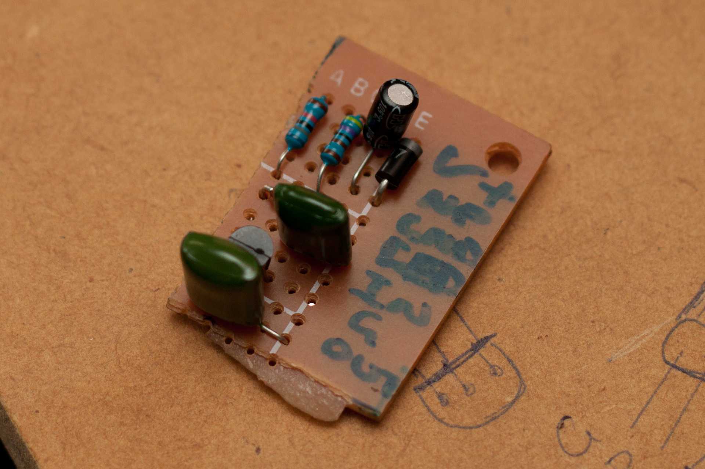
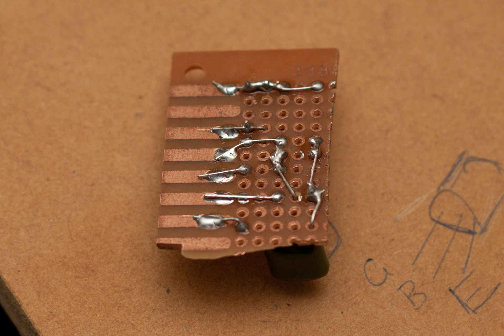
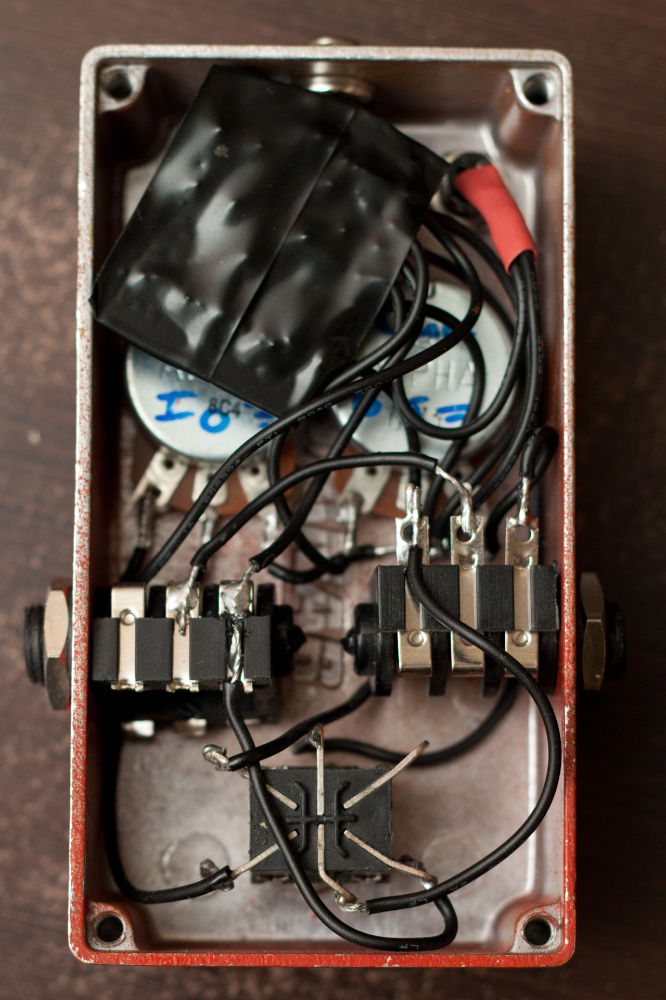

So I&#8217;ve been messing around with DIY guitar effects. In this post I&#8217;m going to talk about my variant of the Bulk Fuzz, a simple but crazy fuzz circuit from Joe Gore at Tonefiend.

By the way,  if you are interested in guitar hacking, then <a href="http://www.tonefiend.com" target="_blank">Tonefiend</a> is a really awesome website &#8211; whether it be weird pickup configurations and wiring schemes, effect circuits, etc. Joe does a really awesome job. The Bulk Fuzz is part of a series on DIY guitar effects.

So, this is not my first attempt at guitar effect circuits. A little while ago I came across a <a href="http://www.barberelectronics.com/Barber_Electronics_DIY.html" target="_blank">schematic</a> from Barber Electronics. Armed with enough knowledge to read a schematic, but not enough to understand what the circuit was actually doing, I set forth to recreate the pedal. You can have a look at <a href="http://www.recordingproject.com/bbs/viewtopic.php?t=38362" target="_blank">my progress</a>, but long story short I made a mistake in the board layout and sent 9V to the opamps instead of 4.5. Woops! So, after a hiatus I&#8217;ve come back to the Bulk Fuzz. It is a much simpler ciruit, a lot easier to see what&#8217;s going on.

### The Build

My version is based on Joe&#8217;s, but with some different capacitor values, and with gain and volume controls (more on that later). Here&#8217;s the schematic:

I built the circuit using perfboard. Last time I used perfboard I made a mistake in transferring. So, this time I used the board layout in Eagle to lay the board out as if I was going to etch a PCB, just to use as a guide for populating the board:

And with that, started soldering. Here are a few picks of the build:

### The Sounds

This circuit is just a bit ridiculous. Here are some sounds, played on a Les Paul, through a vintage Goldentone Reverbmaster amp, SM57 close mic&#8217;d, into an FMR Audio Really Nice Preamp, and into the computer. (ignore my terrible playing).

I really, really like the crazy grating overdrive. This pedal sounds awesome at doing what it&#8217;s good at. In fact, it&#8217;s probably easier to discuss what it isn&#8217;t good at&#8230;

You&#8217;ll notice that palm muting is loose and muddy. You also hear some pretty extreme gating, which cuts the note sustain right off. Changing the value of the input capacitor seems to affect this gating, but if anyone can clue me in on the specifics that would be awesome.

I mentioned above that I have a gain control on the pedal. I didn&#8217;t really have a reason for this, other than I already had it wired into the box from a previous failed pedal, and couldn&#8217;t be bothered changing it around. However, after trying out the circuit, I only really like it at full gain &#8211; I will never use the gain pot. I think on my next build I will have a tone control that fades between input capacitor values instead.

### Some Lessons

Here are the things I&#8217;m taking home from this experiment:

- Don&#8217;t be lazy and put a gain control in if you never intend to use it &#8211; have controls you actually want.
- 24mm potentiometers are way too big &#8211; I can&#8217;t even fit a battery into this box because the pots take up too much room. This is all I could get from my local Jaycar, but next pedal I&#8217;ll definitely use 16mm or even 9mm pots.
- While I&#8217;m complaining about Jaycar, the jacks I got are crap and don&#8217;t do a very good job of holding the guitar leads in. Better jacks are needed in the future.
- I only had a 2 pole footswitch to use, so I switched the output and power. The problem is that I don&#8217;t really have true bypass, and the circuit affects the sound even when it is not enganged. There are a couple of things I would like to try with this. One, I need to go on eBay and get some triple pole switches. Another option I was thinking about is using small relays. I took my tuner pedal apart to see what I could see, and I saw it was using a relay to switch the signal. Probably overkill for a simple fuzz, but interesting none the less.

### In Conclusion

I really like the sounds from this circuit. However, since I never plan on using the gain control, it is a bit of a one trick pony. I think I&#8217;ll tweak it and my next version will have a tone control instead of a gain. Still, it&#8217;s good to finally have a DIY guitar effect that works! I might take another swing at the LTD&#8230;

[1]: ../wp-content/uploads/2012/06/BulkSchematic.png
[2]: ../wp-content/uploads/2012/06/BulkBoard.png
[3]: ../wp-content/uploads/2012/06/20120603-IMG_7968.jpg
[4]: ../wp-content/uploads/2012/06/20120603-IMG_7969.jpg
[5]: ../wp-content/uploads/2012/06/20120603-IMG_7970.jpg
