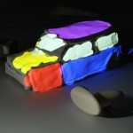

## 2015

  

    Michael Marner, Ross Smith, Bruce Thomas, "Mapping 2D Input to 3D Immersive Spatial Augmented Reality", in <i>Proceedings of the 10th IEEE International Symposium on 3D User Interfaces</i>, Arles, France. 2015. <a href="../wp-content/uploads/2015/10/ViewpointCursor.pdf">[pdf]</a>
  

## 2014

  

    Michael Marner, B Thomas, "Spatial Augmented Reality User Interface Techniques for Room Size Modelling Tasks", in <i>Proceedings of the 15th Australasian User Interface Conference</i>, Auckland, New Zealand 2014. <a href="../wp-content/uploads/2014/06/BuildMyKitchen2014.pdf">[pdf]</a>
  

  

    Michael Marner, Karsten Klein, Ross Smith, Bruce Thomas, Peter Eades, Seok-Hee Hong, "GION: Interactively Untangling Large Graphs on Wall-Sized Displays", in <i>Proceedings of the 22nd International Symposium on Graph Drawing</i>, Würzburg, Germany. 2014. <a href="../wp-content/uploads/2014/12/GraphUntangling.pdf">[pdf]</a> <a href="https://www.youtube.com/watch?v=N8mT5H1wcnc">[video]</a>
  

  

    Bruce Thomas, Michael Marner, Ross Smith, Neven Elsayed, Stewart Von Itzstein, Karsten Klein, Matt Adcock, Peter Eades, Andrew Irlitti, Joanne Zucco, Timothy Simon, James Baumeister, Timothy Suthers, "Spatial Augmented Reality &#8211; A Tool for 3D Data Visualization", in <i>Proceedings of IEEE Vis.</i>, Paris, France. 2014. <a href="../wp-content/uploads/2015/01/IEEE-3DVis-2014-vE-BHT.pdf">[pdf]</a>
  

  

    Michael Marner, Ross Smith, James Walsh, Bruce Thomas, "Spatial User Interfaces for Large Scale Projector-Based Augmented Reality", in <i>Computer Graphics and Applications Magazine, Issue 6, pp 74-82</i>, IEEE 2014. <a href="../wp-content/uploads/2015/01/mcg2014060074.pdf">[pdf]</a> <a href="http://www.youtube.com/">[video]</a>
  

## 2013

  

    Michael Marner, "Physical-Virtual Tools for Interactive Spatial Augmented Reality", 2013. <a href="../wp-content/uploads/2009/10/marner-thesis.pdf">[pdf]</a> <a href="http://www.youtube.com/">[video]</a>
  

  

    Michael Marner, D Irlitti, B Thomas, "Improving Procedural Task Performance with Augmented Reality Annotations", in <i>International Symposium on Mixed and Augmented Reality</i>, Adelaide, South Australia 2013. <a href="../wp-content/uploads/2014/06/ISMAR2013UtlAR.pdf">[pdf]</a> <a href="https://www.youtube.com/watch?v=GqfTy8-fEEY">[video]</a>
  

  

    Michael Marner, B Thomas, "Spatial Augmented Reality User Interface Techniques for Room Size Modeling Tasks", in <i>International Symposium on 3D User Interfaces</i>, Orlando, Florida, USA 2013. <a href="../wp-content/uploads/2014/06/BuildMyKitchen2013.pdf">[pdf]</a>
  

  

    R Smith, G Webber, M Sugimoto, Michael Marner, B Thomas, "Automatic Sub-pixel Projector Calibration", in <i>ITE Transactions on Media Technology and Applications</i>, ITE, Japan 2013. <a href="../wp-content/uploads/2014/06/smith-2013a.pdf">[pdf]</a> <a href="https://www.youtube.com/watch?v=y5H2bzSRT0I">[video]</a>
  

## 2012

  

    E Maas, Michael Marner, R Smith, B Thomas, "Supporting Freeform Modelling in Spatial Augmented Reality Environments with a New Deformable Material", in <i>Proceedings of the 13th Australasian User Interface Conference</i>, Melbourne, Australia 2012. <a href="../wp-content/uploads/2009/09/maas-auic2012.pdf">[pdf]</a> <a href="http://www.youtube.com/watch?v=LqsMzRuDZOs">[video]</a>
  

  

    Michael Marner, S Haren, Matthew Gardiner, B Thomas, "Exploring Interactivity and Augmented Reality in Theater: A Case Study of Half Real", in <i>International Symposium on Mixed and Augmented Reality</i>, Atlanta, Georgia, USA 2012. <a href="../wp-content/uploads/2014/06/HalfReal.pdf">[pdf]</a> <a href="https://www.youtube.com/watch?v=4nowWxi75jE">[video]</a>
  

## 2011

  

    R Smith, Michael Marner, B Thomas, "Adaptive Color Marker for SAR Environments", in <i>Poster Sessions: IEEE Symposium on 3D User Interfaces</i>, Singapore 2011. <a href="../wp-content/uploads/2009/09/3DUI2011_AdaptiveMarker.pdf">[pdf]</a> <a href="http://www.youtube.com/watch?v=s8m9JAe9fZ0">[video]</a>
  

  

    E Maas, Michael Marner, R Smith, B Thomas, "Quimo: A Deformable Material to Support Freeform Modeling in Spatial Augmented Reality Environments", in <i>Poster Sessions: IEEE Symposium on 3D User Interfaces</i>, Singapore 2011. <a href="../wp-content/uploads/2009/09/quimo.pdf">[pdf]</a> <a href="http://www.youtube.com/watch?v=LqsMzRuDZOs">[video]</a>
  

## 2010

  

    Michael Marner, B Thomas, "Augmented Foam Sculpting for Capturing 3D Models", in <i>IEEE Symposium on 3D User Interfaces</i>, Waltham Massachusetts, USA 2010. <a href="http://www.magicvisionlab.com/pub/sandor_ieeevr10/paper.pdf">[pdf]</a> <a href="http://www.youtube.com/watch?v=NAwe-aeS-DY">[video]</a>
  

  

    C Sandor, A Cunningham, U Eck, D Urquhart, G Jarvis, A Dey, S Barbier, Michael Marner, S Rhee, "Egocentric Space-Distorting Visualizations for Rapid Environment Exploration in Mobile Mixed Reality", in <i>IEEE Symposium on Virtual Reality</i>, Waltham Massachusetts, USA 2010. <a href="../wp-content/uploads/2014/06/sandor2010.pdf">[pdf]</a> <a href="http://www.youtube.com/watch?v=NAwe-aeS-DY">[video]</a>
  

  

    S Porter, Michael Marner, R Smith, J Zucco, B Thomas, "Validating Spatial Augmented Reality for Interactive Rapid Prototyping", in <i>proceedings of the 9th IEEE International Symposium on Mixed and Augmented Reality</i>, 2010. <a href="../wp-content/uploads/2009/09/ismar2010.pdf">[pdf]</a> <a href="http://www.youtube.com/watch?v=6SAjX8-iBOc">[video]</a>
  

  

    "Tool Virtualization and Spatial Augmented Reality", in <i>Proceedings of the 20th International Conference on Artificial Reality and Telexistence</i>, Adelaide, South Australia 2010. <a href="../wp-content/uploads/2009/09/icat2010-tvc.pdf">[pdf]</a>
  

## 2009

  

    Michael Marner, B Thomas, C Sandor, "Physical-Virtual Tools for Spatial Augmented Reality User Interfaces", in <i>International Symposium on Mixed and Augmented Reality</i>, Orlando, Florida, USA 2009. <a href="../wp-content/uploads/2009/09/marner.pdf">[pdf]</a> <a href="http://www.youtube.com/watch?v=0bilGEwQgPo">[video]</a>
  

  

    S Porter, Michael Marner, U Eck, C Sandor, B Thomas, "Rundle Lantern in Miniature: Simulating Large Scale Non-Planar Displays", in <i>International Conference on Advances in Computer Entertainment Technology</i>, Athens, Greece 2009. <a href="../wp-content/uploads/2009/09/lantern.pdf">[pdf]</a>
  

  

    C Sandor, A Cunningham, U Eck, D Urquhart, G Jarvis, A Dey, S Barbier, Michael Marner, S Rhee, "Egocentric Space-Distorting Visualizations for Rapid Environment Exploration in Mobile Mixed Reality", in <i>International Symposium on Mixed and Augmented Reality</i>, Orlando, Florida, USA 2009. <a href="../wp-content/uploads/2009/09/sandor.pdf">[pdf]</a> <a href="http://www.youtube.com/">[video]</a>
  

