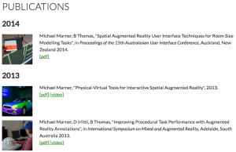
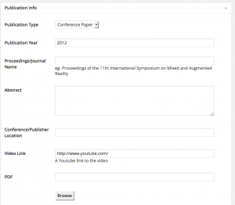

Do you or your research lab need to maintain a list of publications on your website? This WordPress plugin could be for you!

<!--more-->

[][1]The Wearable Computer Lab has a steady stream of publications, which we need to put up on our website. We tried a couple of different approaches that didn&#8217;t really work for us. In the end I put together a WordPress Plugin to keep our Publications list up to date, and we&#8217;re making in available to you!

<a href="https://github.com/WearableComputerLab/WordpressPublications" target="_blank">Publications Archive on Github</a>

Want to see it in action, just have a look at my <a title="Publications" href="../publications/" target="_blank">Publications</a> page!

# Usage

[][2]Once the plugin is installed, you&#8217;ll see **Publications** in the Dashboard. Here you can add publications just like any other WordPress post.

There are fields for you to add all the details of the publication, and link to a Youtube video. You can upload a PDF, and use the Featured Image to add a thumbnail that will appear next to the publication details. You can add authors either as plain text, or by referencing WordPress users. This approach would allow you to add author specific publications lists to profiles.

Once you have your publications added, you can simply use the shortcode [wcl_publications] in any post or page to get the archive list on your website.

Publications are sorted by year and are displayed in an IEEE style.

# Mods and Improvement

The plugin is released under the MIT license, so you are free to use it however you want. Only the bare minimum has been written (I have other things to do), so you may need to write and edit code to get it to work how you want.

If you want to help improve the plugin then please get the code from Github and go for it! I&#8217;m happy to have this grow if people find it useful.

[1]: ../wp-content/uploads/2014/06/Screen-Shot-2014-06-04-at-11.26.44-pm.png
[2]: ../wp-content/uploads/2014/06/Screen-Shot-2014-06-04-at-11.23.15-pm.png
