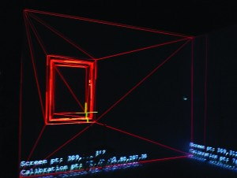

This post explains how I built a projection mapped, interactive graffiti wall for If There Was A Colour Darker Than Black I&#8217;d Wear It. This was built in collaboration with <a href="http://lachlantetlowstuart.com/" target="_blank">Lachlan Tetlow-Stewart</a>. First, here&#8217;s a video of the end result:

Let&#8217;s break down the project.

- Multi projector, projection mapped display onto buildings
- Allow audience members to send SMS messages to tag the building
- Animate tags onto wall
- Video elements

That&#8217;s the basics. Oh, did I mention we&#8217;re projecting out of a van, powered by generator, in rural South Australia?

## 3D Projection Mapping

My research involves Augmented Reality using projectors; quite convenient. Here we create a simple 3D model of the geometry to be projected onto, and create our content mapped to the 3D environment.

This differs from most projection mapping techniques, where content is produced for a specific projector viewpoint and mapped in 2D. The advantage of 3D projection mapping is content can be created *independently* of the projectors. Projectors can be added as necessary, or viewpoints drastically changed, without having to re-author content. In our case, it meant we could project onto the buildings every night, without having to get the van or projectors into exactly the right location each time.<figure id="attachment_758" aria-describedby="caption-attachment-758" style="width: 300px" class="wp-caption alignright">

<figcaption id="caption-attachment-758" class="wp-caption-text">Finding known points on the 3D model in the real world</figcaption></figure>

The 3D models are actually incredibly simple, just enough detail to allow perspectively correct projections. It does, however, require actually measuring the buildings to make sure the 3D model matches the real world. The calibration process involves finding landmarks in the 3D model (corners) in the projector image using a crosshair. From there, maths takes over and we end up with a correctly aligned projection.

This whole project was just an elaborate way to get the phone numbers of audience members. We would be using them later in the show. We played a video telling the audience to text in their tags, which would then appear on the wall.

The computer system received texts using a GSM Modem, as described in my post about [SMS and Linux][1]. The handler put the message into a MySQL database, then an incredibly simple web API allowed the projection system to get new messages as they were received.

We used animated alpha masks and OpenGL blending to make the texts appear in a pleasing manner. All lengths of time (time spent visible, etc) were randomised to make everything feel a bit more natural.

The result was a compelling experience for the audience. They got something fun to occupy themselves before the show proper started, and we got their phone numbers for use later in the show!

## Technical Details

The projection system was a standard desktop computer with 2x Nvidia GTX560 graphics cards, running Ubuntu 12.04. The software was OpenGL and C++, built on top of a Spatial Augmented Reality framework developed in the <a href="http://wearables.unisa.edu.au" target="_blank">Wearable Computer Lab</a> during my [PhD][2].

Text rendering was accomplished using <a href="http://ftgl.sourceforge.net/docs/html/" target="_blank">FTGL</a> texture fonts. The software generated pool of fonts at different sizes, so the best fitting font could be chosen for messages of different lengths. The generation on startup is important &#8211; generating the texture map of an FTGL TextureFont is an expensive process. Changing the size of a font at runtime will give you serious performance problems.

The correct font size had to be calculated for each message. Here&#8217;s my incredibly elegant algorithm for this:

<pre lang="cpp">void GraffitiSpot::setText(std::string text) {
   mText = text;
   int index = 0;
   while (!willItFit()) {
      index++;
      if (index == fontPool.size()) {
         break;
      }
      else {
         mFont = fontPool[index]; 
      }
   }
}</pre>

So basically it looks through the fonts and chooses the biggest font that fits the message in the space available. What does willItFit do?

<pre lang="cpp">bool GraffitiSpot::willItFit() {
   string word;
   float currentLineLength = 0;
   float maxWordLength = 0;
   stringstream currentLine;
   stringstream ss;
   ss &lt;&lt; mText; unsigned numLines = 0; FTPoint point(0,0); while (ss &gt;&gt; word) {
      float wordLength = mFont-&gt;Advance(word.c_str());
      if (wordLength &gt; maxWordLength) {
         maxWordLength = wordLength;
      }

      // if we are at the start of the line, and it fits.. 
      if (currentLineLength == 0) {
         currentLine &lt;&lt; word; currentLineLength += wordLength; } // midway through a line, and it won't fit else if (wordLength + currentLineLength &gt; mWidth) {
         numLines++;
         point.Y(point.Y() - mFont-&gt;LineHeight() * LINE_SCALE);
         currentLine.str("");
         currentLineLength = wordLength;
         currentLine &lt;&lt; word; } // midway through a line, and it does fit else { currentLineLength += mFont-&gt;Advance(" ") + wordLength;
         currentLine &lt;&lt; " " &lt;&lt; word; } } if (currentLineLength &gt; 0) {
     numLines++;
   }

   float heightRequired = mFont-&gt;LineHeight() + ((numLines-1) * mFont-&gt;LineHeight() * LINE_SCALE);
   return heightRequired &lt;= mHeight && maxWordLength &lt; mWidth;
}</pre>

Each graffiti spot has a width and height that limits how much text will fit. This function simulates rendering the text and does some word wrap. FTGL doesn&#8217;t do any text wrapping so it&#8217;s up to us, and we&#8217;re using variable width graf style fonts. We use mFont->Advance() to calculate how many pixels wide a portion of text is. If a word fits on a line, we move to the next one. As soon as a word overflows the width, we drop down a line. We use mFont->LineHeight() to calculate the Y position. LINE_SCALE is just a line height adjustment because we found the default line height to have too much spacing for what we wanted.

If, after simulating rendering the entire message, we have gone beyond the bounds of the graffiti spot, we return false. The function above then tries again with a smaller font. If you wanted to be clever you would do a binary search to speed up finding the optimum font size, but in practice we never hit any performance problems.

[1]: ../programming/sending-receiving-sms-on-linux/
[2]: ../phd-thesis/
