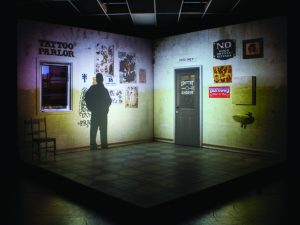

Half Real was a live action, interactive theatre production I worked on with [The Border Project][1] back in 2011. A case study article on Half Real was [published][2] at the 2012 ISMAR conference. This post is a more human readable summary of my work.

Half Real is based on a murder investigation, where the live audience votes on how they investigation proceeds. On stage, actors are immersed into a virtual world projected onto the set. Actors were tracked in 3D on set, and the projections reacted to their actions and movements. I built the software that drove the projected content.

`video: https://youtu.be/4nowWxi75jE`

I worked on Half Real, building the projection software over a four month period. The system builds on technology I was developing at the University of South Australia during my PhD. The code was all in C++ with OpenGL, running on Linux.

## The Stage as a 3D Environment

The projection system for Half Real needed to track actors as they moved about on stage and have projections appear attached to the actors. Simple 2D projection, which is common in performance art, was not going to cut it. Instead, the entire set is modeled as a 3D scene. A calibration process figures out the position and orientation of the projectors, and creates a perspective correct projection in OpenGL. Rather than creating unique content for each projector, the content is created for the scene, and then we figure out what the projectors can see.

This means art assets only need to be created once, regardless of the number of projectors. In addition, more projectors can be easily added. Pre-show setup is simpler, as projectors only need to be roughly aligned; the calibration algorithm takes care of the rest.<figure id="attachment_790" aria-describedby="caption-attachment-790" style="width: 300px" class="wp-caption aligncenter">

 <figcaption id="caption-attachment-790" class="wp-caption-text">3D model of the set</figcaption></figure> <figure id="attachment_791" aria-describedby="caption-attachment-791" style="width: 300px" class="wp-caption aligncenter"><figcaption id="caption-attachment-791" class="wp-caption-text">Projected content in real life</figcaption></figure>

## Actor Tracking<figure id="attachment_785" aria-describedby="caption-attachment-785" style="width: 212px" class="wp-caption alignright">

 <figcaption id="caption-attachment-785" class="wp-caption-text">Projected text attached to the performer</figcaption></figure>

We used a Microsoft [Kinect with OpenNI][3] for tracking actors on set. Kinect works well for theatre; it&#8217;s IR and isn&#8217;t affected by stage lighting, and it&#8217;s cheap. However, there are a few limitations. The tracking isn&#8217;t precise enough to project *onto* actor, so we project onto the set near them. Also, the resolution is low and it can&#8217;t track really small objects.

While the Kinect is quite good at tracking people, it is not able to reliably identify them. Actors enter and exit the set many times throughout each performance. We needed the system to automatically attach the correct information to the correct actor. Through the course of rehearsals, catch areas were identified in each scene. These catch areas are regions on the set that an actor would always walk through. Once the tracking system registered an actor passing through a catch area, that actor was associated with the correct virtual information. In addition to catch areas, dead areas that never associated tracked objects in the system were needed.<figure id="attachment_784" aria-describedby="caption-attachment-784" style="width: 300px" class="wp-caption alignright">

 <figcaption id="caption-attachment-784" class="wp-caption-text">Pre-show projector calibration</figcaption></figure>

The set of Half Real was not simply a static scene, it contained a door and window that actors could use and walk or climb through, and a chair that was moved about on stage. The detection algorithm in the tracker would sometimes incorrectly register these objects as actors. By marking these areas as dead areas, the system would ignore these objects when associating virtual information. As with catch areas, the dead areas were specifically defined for each scene, as in some scenes actors moved into the range of the window or door when the virtual information needed to appear.

The only real problem I found with the Kinect was a bug in Open NI which caused a segfault. Segfaults are always bad, but when your entire set is a projected environment they are even worse. Luckily, I was able to do a [quick fix][4] before opening night.

## Interactivity<figure id="attachment_798" aria-describedby="caption-attachment-798" style="width: 248px" class="wp-caption alignright">

 <figcaption id="caption-attachment-798" class="wp-caption-text">All the possible paths through the show</figcaption></figure>

Half Real was an interactive murder investigation. The audience were asked *&#8220;Who killed Violet Vario?&#8221;* Each scene would uncover clues about the murder, and the audience voted on what to investigate next. This meant that there was around 6 hours of scenes for an hour long show. A graph of the show is shown to the right.

Each member of the audience had a [ZigZag][5] controller, developed by Matthew Gardiner, in their hand. During a scene vote options would appear in the projected world. At the end of the scene the audience would vote on where the investigation would go.

&nbsp;

<p class="jetpack-slideshow-noscript robots-nocontent">
  This slideshow requires JavaScript.
</p>

<div id="gallery-780-2-slideshow" class="slideshow-window jetpack-slideshow slideshow-black" data-trans="fade" data-autostart="1" data-gallery="[{&quot;src&quot;:&quot;http:\/\/www.20papercups.net\/wp-content\/uploads\/2016\/05\/zigzag-red.jpg&quot;,&quot;id&quot;:&quot;794&quot;,&quot;title&quot;:&quot;zigzag-red&quot;,&quot;alt&quot;:&quot;&quot;,&quot;caption&quot;:&quot;The ZigZag uses orientation and colour to allow the audience to vote&quot;,&quot;itemprop&quot;:&quot;image&quot;},{&quot;src&quot;:&quot;http:\/\/www.20papercups.net\/wp-content\/uploads\/2016\/05\/zigzag-green.jpg&quot;,&quot;id&quot;:&quot;793&quot;,&quot;title&quot;:&quot;zigzag-green&quot;,&quot;alt&quot;:&quot;&quot;,&quot;caption&quot;:&quot;The ZigZag uses orientation and colour to allow the audience to vote&quot;,&quot;itemprop&quot;:&quot;image&quot;},{&quot;src&quot;:&quot;http:\/\/www.20papercups.net\/wp-content\/uploads\/2016\/05\/zigzag-blue.jpg&quot;,&quot;id&quot;:&quot;792&quot;,&quot;title&quot;:&quot;zigzag-blue&quot;,&quot;alt&quot;:&quot;&quot;,&quot;caption&quot;:&quot;The ZigZag uses orientation and colour to allow the audience to vote&quot;,&quot;itemprop&quot;:&quot;image&quot;}]" itemscope itemtype="https://schema.org/ImageGallery">
</div>

There was one way communication from the ZigZag voting system to the projection system. The ZigZag system was responsible for communicating with the devices, tallying votes, and keeping track of what scene the show was in. The projection system polled the ZigZag system regularly to find out whether a scene change was necessary via http.

## Resource Management<figure id="attachment_789" aria-describedby="caption-attachment-789" style="width: 212px" class="wp-caption alignright">

 <figcaption id="caption-attachment-789" class="wp-caption-text">Half Real</figcaption></figure>

All those scenes meant a lot of media resources. Half Real&#8217;s projected content consisted of images, video files, and procedurally generated content, such as the vote options. In all, 38GB of assets, mostly video, were used during the show. A _level loading_ approach was used to manage these assets.

Each scene was described in an [XML file][6], which listed the assets required for the scene, transitions and events, etc. A content manager was responsible for freeing data no longer required and loading new assets if required. Assets that were needed in consecutive scenes were reused, rather than reloaded.

```cpp
void HalfReal::loadSceneAssets(const vector &assetList) {
    // set all loaded assets to unused...
    foreach (Asset &asset, mLoadedAssets) {
        asset.second-&gt;inScene = false;
    }
    // iterate over the needed assets
    foreach (string& assetName, assetList) {
        // if it's already loaded, set it to in use...
        if (mLoadedAssets.find(assetName) != mLoadedAssets.end()) {
            mLoadedAssets[assetName]-&gt;inScene = true;
        }
        else {
            mLoadedAssets[assetName] = loadAsset(assetName);
            mLoadedAssets[name]-&gt;inScene = true;
        }
    }
    // free unneeded assets
    for (AssetContainer::iterator it = mLoadedAssets.begin(); it != mLoadedAssets.end(); ++it) {
        if (!((*it).second-&gt;inScene) && !((*it).second-&gt;inUse)) {
            delete it-&gt;second;
            mLoadedAssets.erase(it);
        }
    }
}
```

Note the additional flag inUse. Half Real had smooth transitions between scenes. We didn&#8217;t want to delete an asset that was currently be projected, so we left it in RAM until the next transition.

## Success?<figure id="attachment_787" aria-describedby="caption-attachment-787" style="width: 212px" class="wp-caption alignright">

 <figcaption id="caption-attachment-787" class="wp-caption-text">Who killed Violet Vario?</figcaption></figure>

Half Real successfully completed a tour of regional South Australia, before playing a three week, sold out season as part of the Melbourne Festival in 2011. That achievement is proof the technology and software developed was a success. However, as with any production there are lessons learned and room for improvement.

One of the major issues that had to be overcame was reliability and robustness. In Half Real, if the projection software crashed, the stage went dark. The system had to function correctly day after day, for extended periods of time. Decoupling subsystems was one of the most important factors in making the system robust. For example, it was important that the projection system kept running if the tracking system stopped responding.

Another issue was sequencing content to be projected in each scene. The projection system used [XML files][6] for each scene. This effectively meant there was one scene description for the projection, and another for lighting and sound.If there was time, making the projection system interoperable with existing stage management software, such as QLab, which would reduce the duplication, and make modifying the sequences of projected content much easier.

While Half Real made an important step in using SAR for interactive performance art, there are many more possibilities to be explored. For example, using projectors to simulate physical light sources, such as follow spot lights that automatically track the actor. Or, using the projectors to project directly onto the actors in order to change their appearance.

Turns out, I did some of these things working with Cirkidz!

[1]: http://www.theborderproject.com/
[2]: ../publications/
[3]: ../tag/kinect/
[4]: ../programming/how-openni-nearly-spoiled-the-show/
[5]: http://matthewgardiner.net/art/ZigZag
[6]: https://github.com/MichaelMarner/Half-Real-Scenes
