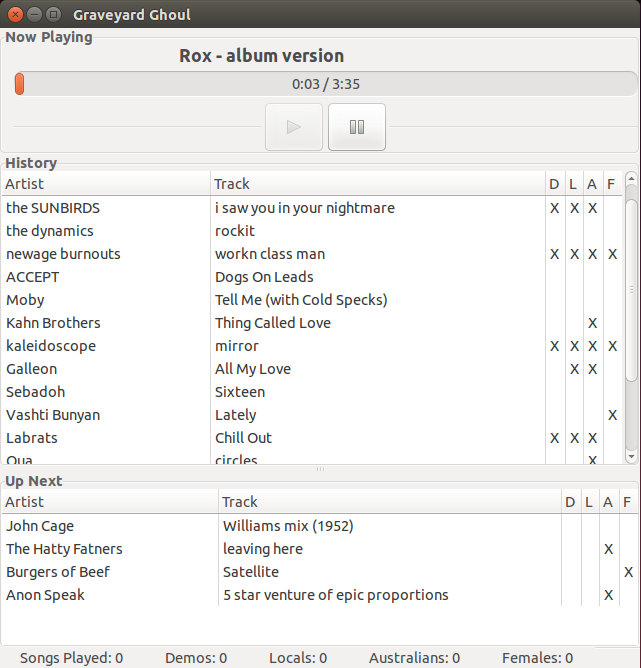

[Three D Radio][1], a community radio station I help run in Adelaide, had a problem. There are sometimes no announcers available for the late night and extremely early morning timeslots. As all the announcers are volunteers, sometimes things come up and an announcer can&#8217;t make it in to do their show. The station switched over to a 5 CD changer and played pre-recorded shows in these situations. There were two glaring problems with this approach:

1. The station&#8217;s volunteers couldn&#8217;t create new pre-recorded shows fast enough. This meant that listeners would end up hearing the same shows again, which is lame.
2. Five CDs isn&#8217;t always enough content to make it through the night. This meant that you could listen to a show, go to bed, wake up the next morning and hear the same show. Even worse!

I built the Graveyard Ghoul to replace the CD changer with a never ending assortment of randomised music. Here&#8217;s how and why.

<a href="https://github.com/ThreeDRadio/GraveyardGhoul" target="_blank">Graveyard Ghoul on GitHub!</a>

## Existing options

So why build something new? Let&#8217;s talk about existing options.

We could just load up an MP3 player with music, switch it to random, and forget about it. However, this would lead to a poor on-air sound, and would probably have the station breaking the law.

Australian community radio law mandates at least 20% of the music broadcast to be Australian. Three D goes further than this and has self imposed quotas of 40% Australian, 20% South Australian, and 25% music containing female artists.

We also need to broadcast messages and station IDs at regular intervals, so listeners know what they&#8217;re listening to. An MP3 player wouldn&#8217;t do this well.

Most radio stations use some kind of [playout software][2] to automate the on air sound. Most of these can be switched into an automatic mode and run the station without anybody present at all. Three D could have taken this approach.

The quotas again would be a problem. Metadata for all the music in Three D&#8217;s collection is stored in a Postgresql database that was implemented long before I joined the station. Most of the mp3 files themselves have either no or missing ID3 tags. So we would have to hack/script any playout software to interface with the existing database, or somehow shoehorn all the metadata into tags in the files themselves.

A fullblown playout software solution was also deemed to heavyweight to put into use. Three D is one of the few stations that don&#8217;t use one. We needed this solved fast, and trialing, purchasing, deploying, and migrating to new software was going to be too much effort for a station of 130 volunteers.

## Requirements

So I decided to try building something new, and if it worked out, suggest the station put it into use. The requirements I had in mind were:

- Super simple user interface (ideally one button to press play)
- Play a randomised selection of music from Three D&#8217;s music library
- Meet all of Three D&#8217;s music quotas
- Regularly broadcast station IDs between songs
- Log the music played to the stations logging system (again, legal requirement)
- Run on Linux (the on-air computer runs OpenSUSE)
- Implement in Python. The main reason for this is there are other volunteers at the station who can code in Python, and could look into things if I wasn&#8217;t around. Otherwise I would have used Java or QT.

## The Solution

After hacking away for a couple of nights after work I had enough to leave running for a week playing music non stop. Obscure bugs would mean the radio station would stop broadcasting, and nobody wants to hear silence on their radio. It now runs every night and whenever an announcer doesn&#8217;t show up.<figure id="attachment_820" aria-describedby="caption-attachment-820" style="width: 641px" class="wp-caption aligncenter">

 <figcaption id="caption-attachment-820" class="wp-caption-text">The graveyard ghoul</figcaption></figure>

### Interesting bits

The Ghoul is a fairly simple, albeit important, piece of software. The main interesting bit is the scheduler, which decides what to play next.

<pre lang="python">def getNextSong(self):
        if self.demoCount / float(self.playCount) &lt; self.demoQuota:
            nextItem = self.music.getRandomDemo()

        elif self.localCount / float(self.playCount) &lt; self.localQuota:
            nextItem = self.music.getRandomLocal()

        elif self.ausCount / float(self.playCount) &lt; self.ausQuota:
            nextItem = self.music.getRandomAustralian()

        elif self.femaleCount / float(self.playCount) &lt; self.femaleQuota:
            nextItem = self.music.getRandomSong(True)

        else:
            nextItem = self.music.getRandomSong(False)

    def getNextItem(self):
        while True: 
            if self.playCount &lt; 5:
                nextItem = self.music.getRandomSong(False)

            # After 5 totally random tracks, we have enough to start working towards quotas...
            else:
                # absolutely must play a sting...
                if self.consecutiveSongs >= self.maxConsecutive:
                    nextItem = self.messages.getRandomSting()

                # Free to choose either a song or a sting
                elif self.consecutiveSongs >= self.minConsecutive:
                    coin = random.randint(0, self.maxConsecutive - self.consecutiveSongs)
                    if coin == 0:
                        nextItem = self.messages.getRandomSting()
                    else:
                        nextItem = self.getNextSong()
                else:
                    nextItem = self.getNextSong()

            # Make sure the mp3 actually exists
            if isinstance(nextItem, Song):
                self.totalRequests += 1
                if self.fileManager.fileExists(nextItem):
                    self.addToPlayCount(nextItem)
                    break;
            else:
                self.consecutiveSongs = 0
                break;
        return nextItem
</pre>

The config file allows the programming committee to tweak the sound. For example, how many songs should be played before a station ID, or what the quotas are for Australian and South Australian music, music featuring female artists, and demos.

The Ghoul plays 5 totally random tracks when it first starts. This seeds the playlog with enough information to then start working towards meeting the quotas.

Stings/station IDs are inserted into the play queue with a bit of randomness, so it isn&#8217;t just a monotonous 4 songs, sting, 4 songs, sting, etc. The randomness can be tweaked through the config file.

Finally, we make sure the MP3 actually exists. This is a problem because some of the music in the catalogue database is from vinyl, or simply hasn&#8217;t been ripped to MP3 yet. The database is a bit of a mess, so the Ghoul checks that there is actually a file there to play. This is also why the method sits in a `while true` loop.

Other than the scheduler, the software makes use of threads to ensure the GUI stays snappy, and Python&#8217;s requests library to handle logging to the station&#8217;s intranet.

Success!

[1]: http://www.threedradio.com
[2]: https://en.wikipedia.org/wiki/Radio_software
