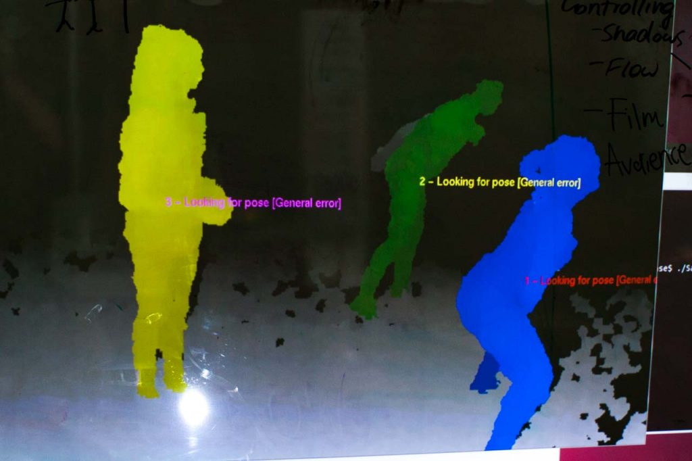
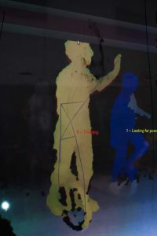
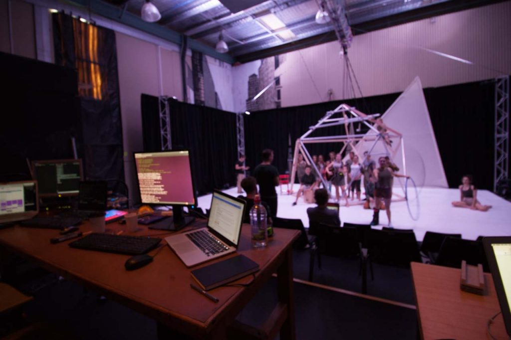

I worked for South Australia&#8217;s youth circus organisation [Cirkidz][1] on their production **We The Unseen**. Using the same 3D projection mapping technology I developed at UniSA and expanding from the work I did with Half Real, we built several interactive projection based special effects to compliment the performance. Let&#8217;s have a look at the **Storm**.

`video: https://youtu.be/sx-SgKO4Bk0`

So what&#8217;s going on here? We have two Microsoft Kinects, either side of the stage, tracking the performers in 3D. We can then use that information to make projected effects that *respond* to the performers movements.

For Storm, I created a particle simulation that would provide a (deliberately abstract) storm effect. We have two particle emitters; one at the top of the triangle at the back of the stage, and another at the front. This gives the illusion that particles are travelling from the sail out onto the floor. Then, we have a couple of forces attached to the performer. The first is a rather strong *attractor*, which draws the particles to the actor. The next is a *vortex*, which manipulates the direction.

The result is a particle system that appears to dance with the performer.

We The Unseen&#8217;s projected effects were developed over a 6 week period. The first step was to figure out what was actually possible to track with the Kinect. These are *circus* _performers,_ not people in their living rooms doing over the top gestures!<figure id="attachment_844" aria-describedby="caption-attachment-844" style="width: 660px" class="wp-caption aligncenter">

 <figcaption id="caption-attachment-844" class="wp-caption-text">Tracking multiple performers</figcaption></figure>

Having multiple actors on stage is fine, even on unicycles:<figure id="attachment_846" aria-describedby="caption-attachment-846" style="width: 200px" class="wp-caption aligncenter">

 <figcaption id="caption-attachment-846" class="wp-caption-text">Skeleton tracking not so much</figcaption></figure>

The main problem was the size of the stage. For this reason we used two Kinect devices, which were connected to separate PCs and sent tracking data using a simple, [custom network protocol][2]. Calibration meant the tracking data would be in the same coordinate system. And again, due to the size of the stage, there was almost no interference between the two devices.

In fact, if there was more time, we would have tried four devices.

One of the things thought about for Half Real but never got done was using projectors as dynamic light sources. In We The Unseen, we had a chance:

`video: https://youtu.be/3oAcsIMK-68`

It mostly works, but you start to see the limits of the Kinect. No matter how precisely you calibrate, depth errors start to cause misalignment of the projection. There&#8217;s also a bit of a jump when the tracking switches devices. But overall, works pretty good.

In a smaller space, you could do some very nice lighting effects with projectors and decent tracking data.

Another problem discovered during Half Real was controlling the projection system. The operator was busy dealing with lighting cues, sound cues, and then an entirely separate projection system.

For We The Unseen, I had time to integrate the projection system with [QLab][3], using [Open Sound Control][4]. This allowed the operator to program the show exclusively in QLab, and OSC messages told the projection system what to do.

There were additional effects that we built but didn&#8217;t make it into the show. For example, we had this idea for some of the acrobatics to create impact effects for when performers landed from great  heights. The problem here was mostly aesthetic. The lighting designer of course wants to light the performers to have the biggest visual impact. For these acrobatic scenes there was simply too much stage lighting for the projectors to cut through. Projectors are getting brighter and brighter, for cheaper, but still can&#8217;t compete against stage lighting. So those effects we left unseen.

We The Unseen &#8211; pretty amazing youth circus, with a couple of special effects by me where they worked.<figure id="attachment_847" aria-describedby="caption-attachment-847" style="width: 660px" class="wp-caption aligncenter">

 <figcaption id="caption-attachment-847" class="wp-caption-text">Tech runs</figcaption></figure>

[1]: http://www.cirkidz.org.au
[2]: ../programming/how-openni-nearly-spoiled-the-show/
[3]: https://figure53.com/qlab/
[4]: http://opensoundcontrol.org/introduction-osc
