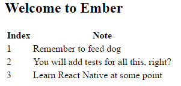

Drag and drop sorting lists of records in an Ember 2 application, using JQuery UI&#8217;s sortable plugin! Working example up on [GitHub][1].

I&#8217;ve been rebuilding [Three D Radio][2]&#8216;s internal software using [Ember JS][3]. One aspect is to allow announcers to create playlists to log what they play on air. I wanted announcers to be able to reorder tracks using simple drag-n-drop. In this post I&#8217;ll explain how to do it.

Firstly, this post is based on the work by [Benjamin Rhodes][4]. However, I found that his solution didn&#8217;t work out of the box. Whether that is API changes from Ember 1.11 to Ember 2.x I&#8217;m not sure. So what I&#8217;m going to do here is bring his technique up to date for 2016 and Ember 2.6.

## Starting an Ember Project

I&#8217;ll build this from scratch so we have a complete example. You shouldn&#8217;t have problems integrating this into an existing project though. So we&#8217;ll create a new Ember CLI project called sortable, and install JQuery UI:

```bash
ember new sortable-demo
cd sortable-demo
bower install --save jqueryui
```

We need to add JQuery UI to our build as well.

```js
// ember-cli-build.js
var EmberApp = require("ember-cli/lib/broccoli/ember-app")

module.exports = function (defaults) {
  var app = new EmberApp(defaults, {
    // Add options here
  })

  app.import("bower_components/jquery-ui/jquery-ui.js")

  return app.toTree()
}
```

## Models

We are going to need a model for the data we are going to sort. Here&#8217;s something simple

```bash
ember generate model note
```

Inside the note model we&#8217;ll have two attributes, the content of the note, and an index for the sorted order:

```js
// app/models/note.js
import Model from "ember-data/model"
import attr from "ember-data/attr"

export default Model.extend({
  index: attr("number"),
  content: attr("string"),
})
```

### Fake data with Mirage

For the sake of this example, we&#8217;ll use Mirage to pretend we have a server providing data. Skip this bit if you have your REST API done.

```bash
ember install ember-cli-mirage
```

And provide some mock data:

```js
// app/mirage/config.js
export default function () {
  this.get("/notes", function () {
    return {
      data: [
        {
          type: "notes",
          id: 1,
          attributes: {
            index: "1",
            content: "Remember to feed dog",
          },
        },
        {
          type: "notes",
          id: 2,
          attributes: {
            index: "2",
            content: "You will add tests for all this, right?",
          },
        },
        {
          type: "notes",
          id: 3,
          attributes: {
            index: "3",
            content: "Learn React Native at some point",
          },
        },
      ],
    }
  })
}
```

## A Route

We will need a route for viewing the list of notes, and a template. Here&#8217;s something simple that will do for now:

```bash
ember generate route list
```

And in here we will simply return all the notes:

```js
// app/routes/list.js
import Ember from "ember"

export default Ember.Route.extend({
  model() {
    return this.store.findAll("note")
  },
})
```

## A template? No, a component!

We are going to display our notes in a table, but the Sortable plugin also works on lists if that&#8217;s what you&#8217;d like to do.

You may be tempted to just put your entire table into the list template that Ember created for you. However, you won&#8217;t be able to activate the Sortable plugin if you try this way. This is because we need to call sortable *after* the table has been inserted into the DOM, and a simple route won&#8217;t give you this hook. So, we will instead create a component for our table!

```bash
ember generate component sortable-table
```

We will get to the logic in a moment, but first let&#8217;s render the table:

```js
// app/templates/components/sortable-table.hbs
<table>
  <thead>
    <tr><th>Index</th><th>Note</th></tr>
  </thead>
  <tbody class="sortable">

    {{#each model as |note|}}
    <tr>
      <td>{{note.index}}</td>
      <td>{{note.content}}</td>
    </tr>
    {{/each}}

  </tbody>
</table>
```

The important part here is to make sure your table contains <span class="lang:default decode:true crayon-inline "><thead></span>  and <span class="lang:default decode:true crayon-inline "><tbody></span>  components. We add the class sortable to the tbody, because that&#8217;s what we will make sortable. If you were rendering as a list, you add the sortable class to the list element.

Finally, in the template for our route, let&#8217;s render the table:

<pre class="lang:default decode:true" title="app/templates/list.hbs">{{sortable-table model=model}}</pre>

We should have something that looks like this:<figure id="attachment_863" aria-describedby="caption-attachment-863" style="width: 301px" class="wp-caption aligncenter">

 <figcaption id="caption-attachment-863" class="wp-caption-text">Our table component rendering the notes</figcaption></figure>

### A quick detour to CSS

Let&#8217;s make this slightly less ugly with a quick bit of CSS.

```css
/* app/styles/app.css */

body {
  font-family: sans-serif;
}
table {
  width: 500px;
}
table th {
  text-align: left;
}

tbody tr:nth-child(odd) {
  background: #ddd;
}
tbody tr:nth-child(even) {
  background: #fff;
}
```

Which gives us a more usable table:<figure id="attachment_864" aria-describedby="caption-attachment-864" style="width: 516px" class="wp-caption aligncenter">

 <figcaption id="caption-attachment-864" class="wp-caption-text">Just make the table a tiny bit less ugly</figcaption></figure>

## Make Them Sortable

Moving over to our component&#8217;s Javascript file, we need to activate the sortable plugin. We do this in the <span class="lang:default decode:true crayon-inline">didInsertElement</span> hook, which Ember calls for you once the component has been inserted into the DOM. In this method, we will look for elements with the sortable class, and make them sortable!

```js
// app/components/sortable-table.js
export default Ember.Component.extend({
  didInsertElement() {
    Ember.$(".sortable").sortable()
    Ember.$(".sortable").disableSelection()
  },
})
```

### Persisting the records

At this point we have a sortable table where users can drag and drop to re-order elements. However, this is purely cosmetic. You&#8217;ll see that when you reorder the table the index column shows the numbers out of order.<figure id="attachment_865" aria-describedby="caption-attachment-865" style="width: 516px" class="wp-caption aligncenter">

 <figcaption id="caption-attachment-865" class="wp-caption-text">We can now reorder notes, but the index fields are not updated</figcaption></figure>

Open up Ember Inspector and you will see the models&#8217; index is never being updated. We&#8217;ll fix this now.

The first step is to store each note&#8217;s ID inside the table row that renders it. We will make use of this ID to update the index based on the order in the DOM. So a slight change to our component&#8217;s template:

`app/templates/components/sortable-table.hbs`

```handlebars
<pre class="lang:xhtml decode:true" title="">{{#each model as |note|}}
    <tr data-id="{{note.id}}">
      <td>{{note.index}}</td>
      <td>{{note.content}}</td>
    </tr>
{{/each}}
```

Next is to give sortable an update function. This gets called whenever a drag-drop is made.

```js
// app/components/sortable-table.js
didInsertElement: function() {

    let component = this;
    Ember.$('.sortable').sortable({
      update: function(e, ui) {
        let indices = {};

        $(this).children().each( (index, item) => {
          indices[$(item).data('id')] = index+1;
        });

        component.updateSortedOrder(indices);
      }
    });

    Ember.$('.sortable').disableSelection();
  }
```

This function iterates over all the sortable elements in our table. Note that we get them from JQuery in their order in the DOM (ie the new sorted order). So, we create an array, and using the item&#8217;s ID store the index for each element. Note that I&#8217;m adding 1 to my indices to give values from 1 instead of 0.  Next step is to use this array to update the records themselves:

```js
// app/components/sortable-table.js
updateSortedOrder(indices) {
    this.beginPropertyChanges();
    let tracks = this.get('model').forEach((note) => {
      var index = indices[note.get('id')];
      if (note.get('index') !== index) {
        note.set('index',index);
        note.save();
      }
    });
    this.endPropertyChanges();
  },
```

We update and save the record only if its index has actually changed. With long lists, this greatly reduces the number of hits to the server. (wish list: A method in ember that will save all dirty records with a single server request!)<figure id="attachment_866" aria-describedby="caption-attachment-866" style="width: 516px" class="wp-caption aligncenter">

 <figcaption id="caption-attachment-866" class="wp-caption-text">Now when we reorder the index fields are updated correctly!</figcaption></figure>

And we&#8217;re done! A sortable list of Ember records, that persist those changes to the server\*.

Have a look on [GitHub][1]!

(Note: If you&#8217;re using Mirage, you&#8217;ll get errors about saving records, because we need code to handle patches).

##

[1]: https://github.com/MichaelMarner/ember-sortable-demo
[2]: http://www.threedradio.com
[3]: http://emberjs.com
[4]: http://nerdyworm.com/blog/2013/04/26/ember-dot-js-drag-and-drop-sorting-with-jquery-sortable/
