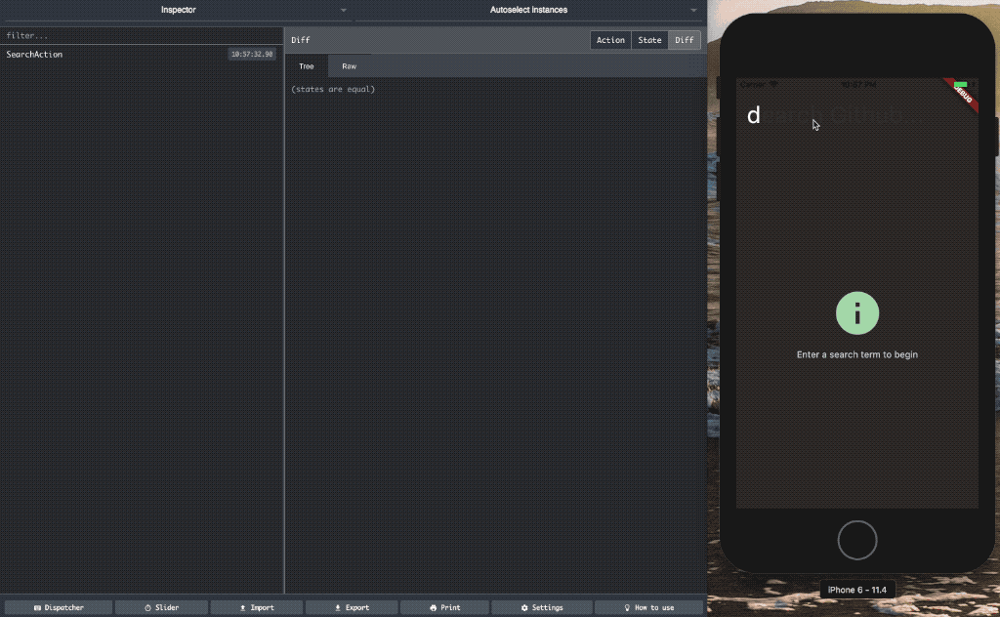
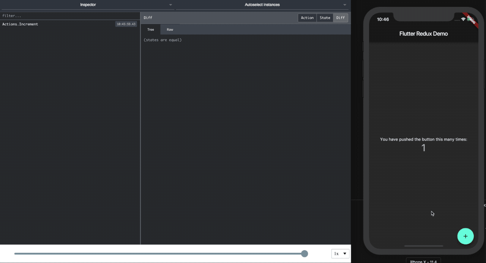

Connect your Flutter app&#8217;s Redux Store to the Redux Devtools from the web!

I really like Flutter, and I like using Redux when building mobile apps. There&#8217;s a great Redux implementation for Dart and Flutter, and a time travel capable debug store.

The Javascript world is spoilt with the fantastic [Redux DevTools plugin][1]. It allows you to inspect actions and application state in a web browser, time travel, and playback changes to your app&#8217;s state. There is an on screen time travel widget for [Flutter][2], but that means sacrificing screen space for the UI.

So why not combine the Redux DevTools from the Javascript world with Redux.dart? Now you can, with the [redux_remote_devtools][3] package!<figure class="wp-block-image">

 <figcaption>Debug your Redux Store with Flutter and Remote DevTools</figcaption></figure>

This article gives a quick overview of how to get setup. The Git repository contains examples to help get you started.

## Getting Started

Add the library to your app&#8217;s pubspec.yaml:

```yaml
dependencies:
  redux-remote-devtools: ^0.0.4
```

And add the middleware to your app, and provide it a reference to your store so time travel actions from the remote can be dispatched:

```dart
var remoteDevtools = RemoteDevToolsMiddleware('YOUR_HOST_IP:8000');
await remoteDevtools.connect();
final store = new DevToolsStore&lt;AppState>(searchReducer,
  middleware: [
    remoteDevtools,
  ]);
remoteDevtools.store = store;
```

Startup the remotedev server, and then run your Flutter app:

```bash
npm install -g remotedev-server
remotedev --port 8000</code></pre>
```

You can then browse to `http://localhost:8000` and start using Remote DevTools to debug your Flutter app!

## Encoding Actions and State

In the Javascript world, Redux follows a convention that your redux state is a plain Javascript Object, and actions are also Javascript objects that have a type property. The JS Redux Devtools expect this. However, Redux.dart tries to take advantage of the strong typing available in Dart. To make Redux.dart work with the JS devtools, we need to convert actions and state instances to JSON before sending.

Remember that the primary reason for using devtools is to allow the developer to reason about what the app is doing. Therefore, exact conversion is not strictly necessary &#8211; it&#8217;s more important for what appears in devtools to be meaningful to the developer.

To make your actions and state JSON encodable, you have two options. Either add a `toJson` method to all your classes, or using a package like [json_serializable][4] to generate the serialisation code at build time. The GitHub search example demonstrates both approaches.

If your store is simple then you may be using `enum`s for actions. These encode just fine without any extra effort.

## Time Travel

If you have configured your app to use the DevToolsStore from `redux_devtools`, then you can time travel through your app state using the UI. <figure class="wp-block-image">

 <figcaption>Time Travel through your app</figcaption></figure>

Remember that there are limitations to time travel, especially if you are using epics or other asynchronous processing with your Redux store.

<hr class="wp-block-separator" />

Being a new library there are still things to work out. PRs are welcome if you&#8217;re up for helping out.

Now go build something cool with Flutter!

[1]: http://extension.remotedev.io/
[2]: https://pub.dartlang.org/packages/flutter_redux_dev_tools
[3]: https://github.com/MichaelMarner/dart-redux-remote-devtools
[4]: https://pub.dartlang.org/packages/json_serializable
