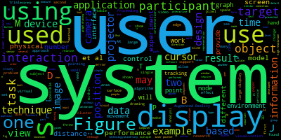
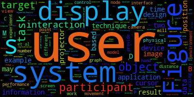

My friend Dani posed an interesting question on Twitter yesterday:

<blockquote class="twitter-tweet"><p lang="en" dir="ltr">Research pals, esp. those that use <a href="https://twitter.com/hashtag/zotero?src=hash&amp;ref_src=twsrc%5Etfw">#zotero</a> - do you know if there is a way I can visualise data from my library, e.g. word clouds? Paperplanes plugin no longer exists :( what I&#39;d really like to do is see what words are coming up after a particular word is featured in the papers.</p>&mdash; Dr Daniella Trimboli (she/her) (@djtrimboli) <a href="https://twitter.com/djtrimboli/status/1540167302963789824?ref_src=twsrc%5Etfw">June 24, 2022</a></blockquote>

I used [Zotero](https://zotero.org) to manage my bibliography during and after my PhD, and like any recovering academic, I have a giant folder full of PDFs that I am weirdly attached to and can't bring myself to delete.

So I thought to myself: This must be possible, and I certainly don't have anything better to do with my time.

We are going to make use of two Python packages: [pdftotext](https://pypi.org/project/pdftotext/) and [wordcloud](https://pypi.org/project/wordcloud/). The following was done on a Mac but it should work anywhere Python works.

> **Note**: There's nothing actually Zotero specific here, the following works on any large directory of PDFs

## A note on Zotero's filesystem

Zotero's local database consists of it's SQLite bibliography database, and linked files. Linked files are stored in a tree directory structure, so lots of directories with a few files in each. So we will need to traverse these folders to find all PDFs.

## Installing Packages

Assuming you have Python installed, we need to install the command line tools we will use. Instructions for Mac.

```bash
brew install pkg-config poppler python
pip install wordcloud pdftotext
```

_Hopefully_ that all goes smoothly. I can't help you install Python, sorry.

## Converting a library of PDFs to a giant text file

The Wordcloud tool builds wordcloud images from a text file. We have a bit set of PDFs. So the first step is to merge the content of the PDFs into one giant text file.

```bash
find $THE_DIRECTORY_WHERE_MY_PDFS_ARE -name '*.pdf' -exec pdftotext "{}" - >> combined_text.txt \;
```

We now have a single text file containing all of the text content of all the PDFs in it. Note: This won't work for scanned PDFs.

## Converting the text to a wordcloud

Now that we have a single text file containing all our text, we can feed that into wordcloud.

```bash
wordcloud_cli --text combined_text.txt --imagefile wordcloud.png
```

Depending on how big your library is, this could take a little while. But you should end up with a nice Wordcloud:



The Wordcloud package has lots of options for customising the output.

### Excluding Words

You can provide a list of words you want excluded. In the example above, 'use', 'using', and 'used' aren't particularly useful. To exclude words, create a new text file with each excluded word on its own line, and provide it to `wordcloud`. This is great for excluding common words that are not particularly interesting for your topic.

Wordcloud has a built in list of stop words, and providing your own overrides its built in ones. You can start with the default list, which you can find [here](https://github.com/amueller/word_cloud/blob/master/wordcloud/stopwords), and add your own words to it.

```bash
wordcloud_cli --text combined_text.txt --imagefile wordcloud.png --stopwords excluded.txt
```

And we end up with this:



### Excluding short words

In addition to the stopwords list, you can also tell Wordcloud to just not include words shorter than a specific length:

```bash
wordcloud_cli --text combined_text.txt --imagefile wordcloud.png --stopwords excluded.txt --min_word_length 8
```

Things start to get a bit more interesting:


### Customising the output

There are many ways to customise the resulting image, just run `wordcloud --help` for a list of all options. For example:

```bash
wordcloud_cli --text combined_text.txt \
              --imagefile wordcloud.png \
              --background white \
              --color purple \
              --min_word_length 8 \
              --width 1280 \
              --height 720 \
              --fontfile intro.otf
```

Which gives you this:


You get the idea.

## Bonus: Work on a subset of my Zotero Library

If you have a big giant sprawling Zotero library, or different libraries for different projects, you might want to generate wordclouds from just some of your documents. You can export files from Zotero to accomplish this.

1. Select the publications you want to use
2. Right click and select **Export Items**
3. On the export options, make sure **Export Files** is checked
4. Choose where to save the export

You'll end up with a new folder containing just the PDFs you selected.

## Going Further

The `wordcloud_cli` is just a frontend to the `wordcloud` Python package. If the command line options don't give you the customisation you are looking for then you can write code to accomplish what you want.
